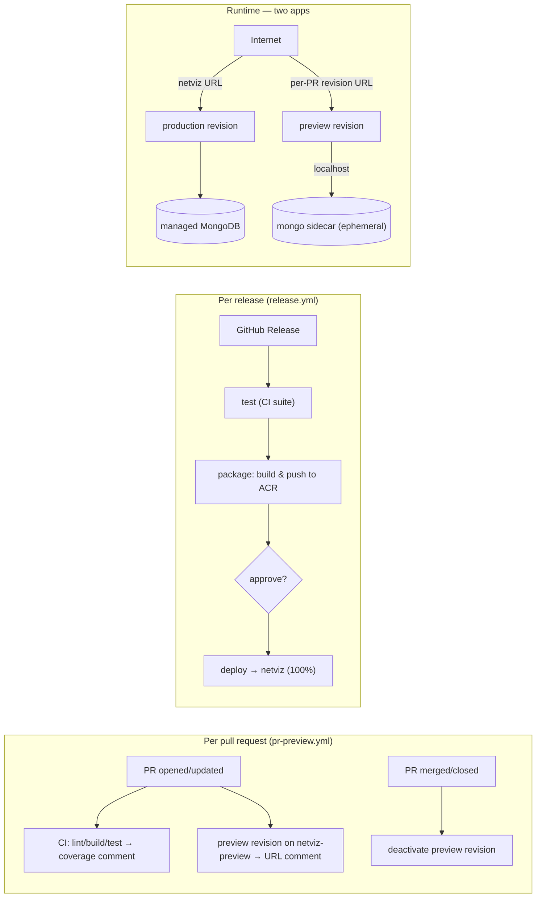

# Deployment

NetViz is a single self-contained container (Express API that also serves the
built SPA). It deploys to **Azure Container Apps** — managed HTTPS ingress, a
free `*.azurecontainerapps.io` URL, and no server to patch. The database is a
managed MongoDB (Cosmos DB for MongoDB vCore, or MongoDB Atlas).

Two Container Apps: **`netviz`** (production, single-revision, on managed
MongoDB) and **`netviz-preview`** (per-PR previews, multiple-revision, with a
**mongo sidecar**). A pull request rolls its image onto a new revision of the
preview app — its own public URL, its own throwaway database — and production is
never touched. Only a release ships to `netviz`.

## Guides

- **[azure-container-apps.md](./azure-container-apps.md)** — the full runbook:
  provision (ACR, database, Container App), no-domain setup (free ACA URL),
  custom domains, and continuous delivery.

## Per-PR previews (pr-preview.yml)

Every pull request gets an isolated, ephemeral preview on the **dedicated
`netviz-preview` app** — production is never involved:

1. **test → coverage comment** — [`ci.yml`](../.github/workflows/ci.yml) runs
   lint/build/tests and posts the server coverage as a sticky PR comment.
2. **preview → URL comment** — [`pr-preview.yml`](../.github/workflows/pr-preview.yml)
   builds the PR image and updates **only the app container** on `netviz-preview`
   (the **mongo sidecar** in its template is preserved), creating a new revision
   with its own FQDN
   `https://netviz-preview--pr-<N>-<sha>.<region>.azurecontainerapps.io`, posted
   as a sticky comment. The app talks to the sidecar over `localhost`, so each
   preview has its **own throwaway database** — no production data, no shared
   secrets. The sidecar has no volume, so its data resets if the replica restarts.
3. **merge/close → teardown** — closing the PR deactivates its preview
   revision(s), stopping the replica. Nothing to clean up by hand.

It is inert until you set the repository variable **`PREVIEW_ENABLED=true`**, and
never runs for fork PRs (their token can't read secrets). Preview deploys use the
`staging` GitHub environment purely for its OIDC identity — they never require
approval and never touch production.

> **Cost note.** Preview revisions run at `minReplicas=1` (app + mongo ≈ 1 vCPU /
> 2 GiB) so the reviewer never hits a cold-start DB race. That runs while a PR is
> open and stops on teardown, so cost scales with the number of open PRs. The
> whole `netviz-preview` app is idle (no cost) when no previews are active.

### Provisioning the preview app (one-time)

`netviz-preview` is a normal Container App in the same environment, in
multiple-revision mode, with two containers in its template — the app and a
`mongo:7` sidecar (mirrored into ACR as `<acr>.azurecr.io/mongo:7`). It uses
`REQUIRE_AUTH=false`, `ALLOW_DEV_LOGIN=true`, a random `JWT_SECRET`, and
`MONGODB_CONNECTION_STRING=mongodb://localhost:27017/netviz`. See
[azure-container-apps.md](./azure-container-apps.md) for the exact commands.

## Releases → production (release.yml)

Publishing a GitHub Release (`v1.2.3`) is the **only** thing that moves
production traffic. [`release.yml`](../.github/workflows/release.yml) runs three
jobs on the tagged commit:

1. **test** — reuses [`ci.yml`](../.github/workflows/ci.yml) so nothing ships
   that hasn't passed lint/build/tests.
2. **package** — [`package.yml`](../.github/workflows/package.yml) builds the
   client + Docker image and pushes it to ACR with the admin credentials.
3. **deploy → production** — [`deploy.yml`](../.github/workflows/deploy.yml)
   creates a new revision of `netviz` from that image; single-revision mode routes
   **100% of traffic** to it, and it sets
   `MONGODB_CONNECTION_STRING=secretref:mongo-uri` explicitly. Give the
   `production` environment a **Required reviewers** rule so this job pauses for a
   maintainer's approval — the manual go-live gate.

`deploy.yml` also runs standalone (`workflow_dispatch` with a `tag`), so it
doubles as the rollback tool: dispatch it with any older tag to cut production
back to it.

### One-time setup

- **Secrets** (repo-level): `AZURE_CLIENT_ID`, `AZURE_TENANT_ID`,
  `AZURE_SUBSCRIPTION_ID`, `ACR_USERNAME`, `ACR_PASSWORD`.
- **Variables** (repo-level): `ACR_NAME`, `IMAGE_NAME`, `RESOURCE_GROUP`,
  `CONTAINERAPP_NAME` (production, `netviz`) and `PREVIEW_CONTAINERAPP_NAME`
  (preview, `netviz-preview`).
- **Environments**: `staging` (no gate — used only for preview OIDC) and
  `production` (**Required reviewers** = the go-live gate).
- **OIDC**: one federated credential per environment on the app registration,
  subjects `repo:<owner>/<repo>:environment:staging` and
  `repo:<owner>/<repo>:environment:production` (the service principal is
  Contributor on the resource group, so it manages both apps).
- **Preview app**: provision `netviz-preview` (see above), then
  `gh variable set PREVIEW_ENABLED -R <owner>/<repo> --body true`.

See the runbook for the one-time provisioning of the registry, database and
Container App.

## Related

- Image / app metadata (OCI labels, footer version) — see
  [`application/Dockerfile`](../application/Dockerfile) and
  [`application/client/.env.example`](../application/client/.env.example).
- Roles & administration — see [`organizational/`](../organizational/README.md).
