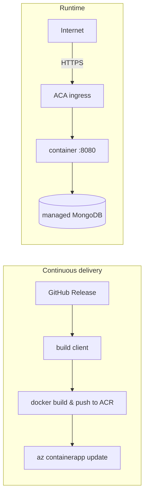

# Deployment

NetViz is a single self-contained container (Express API that also serves the
built SPA). It deploys to **Azure Container Apps** — managed HTTPS ingress, a
free `*.azurecontainerapps.io` URL, and no server to patch. The database is a
managed MongoDB (Cosmos DB for MongoDB vCore, or MongoDB Atlas).

## Guides

- **[azure-container-apps.md](./azure-container-apps.md)** — the full runbook:
  provision (ACR, database, Container App), no-domain setup (free ACA URL),
  custom domains, and continuous delivery.

## Continuous delivery

Publishing a GitHub Release (`v1.2.3`) triggers
[`release.yml`](../.github/workflows/release.yml), which chains two reusable
workflows: [`package.yml`](../.github/workflows/package.yml) (build client +
Docker image, push to ACR with the admin credentials) and
[`deploy.yml`](../.github/workflows/deploy.yml) (`az containerapp update` via
OIDC). Both can also be dispatched manually — `deploy.yml` doubles as the
rollback tool for any existing tag. Requires the repo secrets
`AZURE_CLIENT_ID`, `AZURE_TENANT_ID`, `AZURE_SUBSCRIPTION_ID`,
`ACR_USERNAME`, `ACR_PASSWORD` and variables `RESOURCE_GROUP`, `ACR_NAME`,
`CONTAINERAPP_NAME`, `IMAGE_NAME`. See the runbook for the one-time
provisioning.

## Related

- Image / app metadata (OCI labels, footer version) — see
  [`application/Dockerfile`](../application/Dockerfile) and
  [`application/client/.env.example`](../application/client/.env.example).
- Roles & administration — see [`organizational/`](../organizational/README.md).
