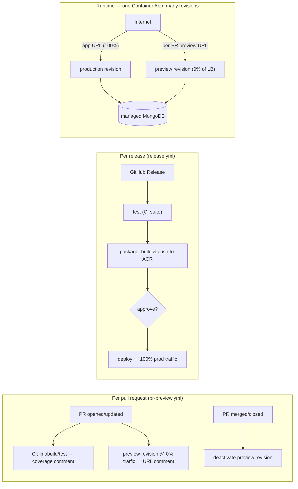

# Deployment

NetViz is a single self-contained container (Express API that also serves the
built SPA). It deploys to **Azure Container Apps** — managed HTTPS ingress, a
free `*.azurecontainerapps.io` URL, and no server to patch. The database is a
managed MongoDB (Cosmos DB for MongoDB vCore, or MongoDB Atlas).

One Container App serves everything. It runs in **multiple-revision mode**, so a
pull request can spin up its **own 0%-traffic preview revision** (off the load
balancer, but with its own public URL) while releases shift 100% of production
traffic onto a new revision.

## Guides

- **[azure-container-apps.md](./azure-container-apps.md)** — the full runbook:
  provision (ACR, database, Container App), no-domain setup (free ACA URL),
  custom domains, and continuous delivery.

## Per-PR previews (pr-preview.yml)

Every pull request gets, on the **same** Container App, its own ephemeral
preview — no separate environment or app to provision:

1. **test → coverage comment** — [`ci.yml`](../.github/workflows/ci.yml) runs
   lint/build/tests and posts the server coverage as a sticky PR comment.
2. **preview → URL comment** — [`pr-preview.yml`](../.github/workflows/pr-preview.yml)
   builds the PR image and creates a **new revision** on the app. In
   multiple-revision mode that revision takes **0% of the load-balanced
   traffic** (it is off the load balancer) but keeps its **own public FQDN**
   `https://<app>--pr-<N>-<sha>.<region>.azurecontainerapps.io`, posted as a
   sticky comment. Idle previews scale to zero, so they cost nothing.
3. **merge/close → teardown** — closing the PR deactivates its preview
   revision(s). Nothing to clean up by hand.

It is inert until you set the repository variable **`PREVIEW_ENABLED=true`**, and
never runs for fork PRs (their token can't read secrets). Preview deploys use the
`staging` GitHub environment purely for its OIDC identity + config — they never
require approval and never move production traffic.

> ⚠️ **Shared data.** Preview revisions inherit the app's env vars and secrets,
> including the **production database**. They run different code against the same
> data. If that's not acceptable, give previews their own datastore (e.g. a
> per-preview `MONGODB_CONNECTION_STRING` secret, or a dedicated preview app).

## Releases → production (release.yml)

Publishing a GitHub Release (`v1.2.3`) is the **only** thing that moves
production traffic. [`release.yml`](../.github/workflows/release.yml) runs three
jobs on the tagged commit:

1. **test** — reuses [`ci.yml`](../.github/workflows/ci.yml) so nothing ships
   that hasn't passed lint/build/tests.
2. **package** — [`package.yml`](../.github/workflows/package.yml) builds the
   client + Docker image and pushes it to ACR with the admin credentials.
3. **deploy → production** — [`deploy.yml`](../.github/workflows/deploy.yml)
   creates a new revision from that image and shifts **100% of traffic** onto it
   (preview revisions stay at 0%, untouched). Give the `production` environment a
   **Required reviewers** rule so this job pauses for a maintainer's approval —
   the manual go-live gate.

`deploy.yml` also runs standalone (`workflow_dispatch` with a `tag`), so it
doubles as the rollback tool: dispatch it with any older tag to cut production
back to it.

### One-time setup

- **App in multiple-revision mode** — the workflows call
  `az containerapp revision set-mode --mode multiple` (idempotent), but you can
  set it once up front: `az containerapp revision set-mode -g <rg> -n <app> --mode multiple`.
- **Secrets** (repo-level): `AZURE_CLIENT_ID`, `AZURE_TENANT_ID`,
  `AZURE_SUBSCRIPTION_ID`, `ACR_USERNAME`, `ACR_PASSWORD`.
- **Variables** (all repo-level, since previews and releases share one app):
  `ACR_NAME`, `IMAGE_NAME`, `RESOURCE_GROUP`, `CONTAINERAPP_NAME`. (If you ever
  split staging onto its own app, override `RESOURCE_GROUP`/`CONTAINERAPP_NAME`
  per environment.)
- **Environments**: `staging` (no gate — used only for preview OIDC) and
  `production` (**Required reviewers** = the go-live gate).
- **OIDC**: one federated credential per environment on the app registration,
  subjects `repo:<owner>/<repo>:environment:staging` and
  `repo:<owner>/<repo>:environment:production`.
- **Enable previews**: `gh variable set PREVIEW_ENABLED -R <owner>/<repo> --body true`.

See the runbook for the one-time provisioning of the registry, database and
Container App.

## Related

- Image / app metadata (OCI labels, footer version) — see
  [`application/Dockerfile`](../application/Dockerfile) and
  [`application/client/.env.example`](../application/client/.env.example).
- Roles & administration — see [`organizational/`](../organizational/README.md).
