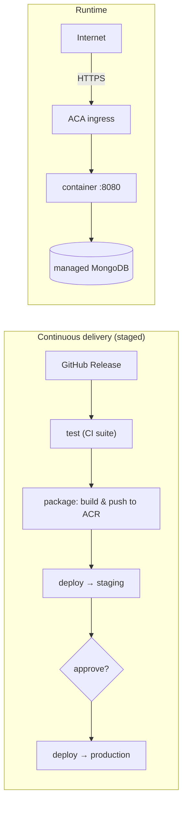

# Deployment

NetViz is a single self-contained container (Express API that also serves the
built SPA). It deploys to **Azure Container Apps** — managed HTTPS ingress, a
free `*.azurecontainerapps.io` URL, and no server to patch. The database is a
managed MongoDB (Cosmos DB for MongoDB vCore, or MongoDB Atlas).

## Guides

- **[azure-container-apps.md](./azure-container-apps.md)** — the full runbook:
  provision (ACR, database, Container App), no-domain setup (free ACA URL),
  custom domains, and continuous delivery.

## Continuous delivery

Publishing a GitHub Release (`v1.2.3`) triggers
[`release.yml`](../.github/workflows/release.yml), which runs the release through
four staged jobs — the image is built once and the **same** tag is promoted
through each environment:

1. **test** — reuses [`ci.yml`](../.github/workflows/ci.yml) (lint / build /
   tests on the tagged commit) so nothing ships that hasn't passed.
2. **package** — [`package.yml`](../.github/workflows/package.yml) builds the
   client + Docker image and pushes it to ACR with the admin credentials.
3. **deploy → staging** — [`deploy.yml`](../.github/workflows/deploy.yml)
   (`az containerapp update` via OIDC) rolls the image out to the `staging`
   environment automatically.
4. **deploy → production** — the same `deploy.yml` promotes the identical tag to
   `production`. Give the `production` environment a **Required reviewers**
   protection rule so this job pauses for a maintainer's approval — that is the
   manual gate to go live.

`deploy.yml` also runs standalone (`workflow_dispatch` with a `tag` and an
`environment` choice), so it doubles as the rollback tool for any tag in any
environment.

### One-time setup

- **Secrets** (repo-level): `AZURE_CLIENT_ID`, `AZURE_TENANT_ID`,
  `AZURE_SUBSCRIPTION_ID`, `ACR_USERNAME`, `ACR_PASSWORD`.
- **Variables**: `ACR_NAME` and `IMAGE_NAME` can stay repo-level (one registry
  is shared). Scope `RESOURCE_GROUP` and `CONTAINERAPP_NAME` **per environment**
  so staging and production target their own Container Apps.
- **Environments**: create `staging` and `production` under *Settings →
  Environments*. Add **Required reviewers** to `production` for the manual gate.
- **OIDC**: add one federated credential per environment on the app
  registration, subject
  `repo:<owner>/<repo>:environment:staging` and
  `repo:<owner>/<repo>:environment:production`, so each deploy job logs in to
  Azure without a stored secret.

See the runbook for the one-time provisioning of the registry, database and
Container App.

## Related

- Image / app metadata (OCI labels, footer version) — see
  [`application/Dockerfile`](../application/Dockerfile) and
  [`application/client/.env.example`](../application/client/.env.example).
- Roles & administration — see [`organizational/`](../organizational/README.md).
