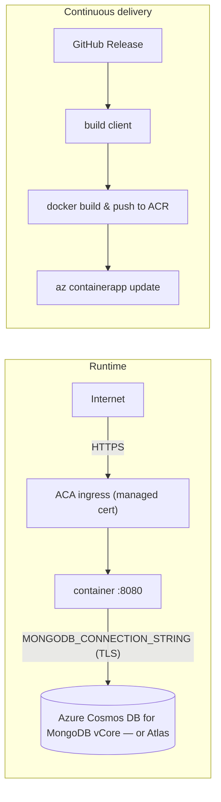

# Deploy to Azure Container Apps (ACA)

The deployment target for NetViz. ACA runs the container and provides HTTPS
ingress with managed TLS certificates, scales to/from zero, and needs no OS to
patch.
Because ACA is **stateless**, the database is a managed service (Cosmos DB for
MongoDB vCore, or MongoDB Atlas).

## Architecture



The app already serves its own SPA and reads `X-Forwarded-Proto` (it trusts one
proxy hop), so ACA's ingress gives you working `Secure` cookies with no proxy of
your own.

---

## Part 1 — Registry + database

```bash
az login
az group create -n netviz-rg -l westeurope

# Azure Container Registry (name must be globally unique, alphanumeric)
az acr create -g netviz-rg -n netvizacr --sku Basic
```

**Database — use a real MongoDB** (the app relies on standard features like TTL
indexes, which the RU-based Cosmos Mongo API does not fully support). Two good options:

- **Azure Cosmos DB for MongoDB *vCore*** — managed, full MongoDB compatibility.
  Easiest to create in the Portal (*Create → Azure Cosmos DB → MongoDB → vCore*).
  CLI (flag names vary by CLI version — verify with `az cosmosdb mongocluster create --help`):

  ```bash
  az extension add --name cosmosdb-preview --upgrade
  az cosmosdb mongocluster create \
    -g netviz-rg -c netviz-mongo --location westeurope \
    --administrator-user-name netvizadmin \
    --administrator-password '<STRONG_PASSWORD>' \
    --server-version 7.0 --shard-node-tier M25 --shard-node-count 1 \
    --shard-node-disk-size-gb 32
  # then add a firewall rule allowing Azure services (0.0.0.0-0.0.0.0)
  ```

- **MongoDB Atlas** (free M0 tier works) — create a cluster, allow access from
  anywhere (or the ACA outbound IP), copy the `mongodb+srv://…` string.

Your connection string looks like (note `retrywrites=false` for Cosmos):

```text
mongodb+srv://netvizadmin:<pw>@netviz-mongo.global.mongocluster.cosmos.azure.com/netviz?tls=true&authMechanism=SCRAM-SHA-256&retrywrites=false
```

---

## Part 2 — Create the Container App

```bash
az extension add --name containerapp --upgrade
az provider register -n Microsoft.App
az provider register -n Microsoft.OperationalInsights

# Container Apps environment
az containerapp env create -g netviz-rg -n netviz-env -l westeurope

# First, build an initial image so the app has something to run
#   (later releases are built by the CD workflow)
cd application/client && npm ci && npm run build && cd -
az acr build --registry netvizacr --image netviz:bootstrap ./application

# Create the app: external ingress on 8080, secrets, env, pull from ACR via
# the app's managed identity.
az containerapp create \
  -g netviz-rg -n netviz \
  --environment netviz-env \
  --image netvizacr.azurecr.io/netviz:bootstrap \
  --registry-server netvizacr.azurecr.io \
  --registry-identity system \
  --ingress external --target-port 8080 \
  --min-replicas 1 --max-replicas 3 \
  --secrets \
      jwt-secret="$(openssl rand -hex 32)" \
      mongo-uri="<your MONGO connection string>" \
      google-secret="<google client secret>" \
      ms-secret="<microsoft client secret>" \
  --env-vars \
      NODE_ENV=production PORT=8080 \
      REQUIRE_AUTH=false ALLOW_DEV_LOGIN=false MICROSOFT_TENANT=common \
      GOOGLE_CLIENT_ID="<google client id>" MICROSOFT_CLIENT_ID="<microsoft client id>" \
      JWT_SECRET=secretref:jwt-secret \
      MONGODB_CONNECTION_STRING=secretref:mongo-uri \
      GOOGLE_CLIENT_SECRET=secretref:google-secret \
      MICROSOFT_CLIENT_SECRET=secretref:ms-secret

# The app's public URL:
az containerapp show -g netviz-rg -n netviz \
  --query properties.configuration.ingress.fqdn -o tsv
```

Open `https://<that-fqdn>` — the first account to sign in becomes **admin**.
OAuth redirect URIs are derived from the URL you browse to, so no URL env var is
needed — just register the callback (see below) with each provider.
(`--registry-identity system` grants the app's identity
`AcrPull`; if your CLI version doesn't, run
`az role assignment create --assignee <app-identity> --role AcrPull --scope <acr-id>`.)

---

## No custom domain? (use the free ACA URL)

You don't need a domain. ACA already served the app at a free HTTPS address
(`https://<app>.<region>.azurecontainerapps.io`):

```bash
FQDN=$(az containerapp show -g netviz-rg -n netviz --query properties.configuration.ingress.fqdn -o tsv)
echo "Open: https://$FQDN"
```

Skip Part 3 entirely. Two things to know without a domain:

- **OAuth** still works — register `https://$FQDN/auth/{google|microsoft}/callback`
  as the redirect URI. Or skip OAuth: with `REQUIRE_AUTH=false` the app is fully
  usable anonymously (shared "local" workspace).
- **The status page** lives on a `status.` subdomain, which needs a custom domain.
  Without one it isn't reachable (the `/status` path route was removed). Ask me to
  add a `/status` fallback route if you want the status page on the free URL.

---

## Part 3 — Custom domain + the status subdomain (GoDaddy)

ACA binds multiple hostnames to one app, each with a free managed certificate.
For each hostname add the ACA validation record, then bind:

```bash
# Get the validation token + the environment's static inbound IP
az containerapp env show -g netviz-rg -n netviz-env \
  --query properties.staticIp -o tsv
az containerapp hostname add -g netviz-rg -n netviz --hostname example.com   # prints an asuid TXT token
```

In **GoDaddy → DNS**, create:

| Host           | Type  | Value                             |
| -------------- | ----- | --------------------------------- |
| `@`            | A     | the environment static IP         |
| `asuid`        | TXT   | the validation token for the apex |
| `www`          | CNAME | the app FQDN                      |
| `asuid.www`    | TXT   | validation token for www          |
| `status`       | CNAME | the app FQDN                      |
| `asuid.status` | TXT   | validation token for status       |

Then bind each with a managed cert:

```bash
for H in example.com www.example.com status.example.com; do
  az containerapp hostname bind -g netviz-rg -n netviz \
    --hostname "$H" --environment netviz-env --validation-method CNAME
done
```

Update your OAuth redirect URIs to
`https://example.com/auth/{google|microsoft}/callback`. The `status.` name
works automatically — the SPA detects the hostname and renders the status page.

---

## Part 4 — Continuous delivery

Two Container Apps: **`netviz`** (production) and **`netviz-preview`** (per-PR
previews with a mongo sidecar).

- **Releases** ([`release.yml`](../.github/workflows/release.yml)) chain
  [`package.yml`](../.github/workflows/package.yml) (builds the image and
  **pushes it to ACR with the registry admin username/password**) then
  [`deploy.yml`](../.github/workflows/deploy.yml), which logs in with
  **OpenID Connect** (federated credentials — no stored client secret) and rolls
  a new revision of **`netviz`**. Production is single-revision, so the new
  revision serves 100%. Dispatch `deploy.yml` with any older tag to roll back.
- **Pull requests** ([`pr-preview.yml`](../.github/workflows/pr-preview.yml)) roll
  the PR image onto a new revision of **`netviz-preview`**, reachable at its own
  FQDN `https://netviz-preview--pr-<N>-<sha>.<region>.azurecontainerapps.io`.
  Closing the PR deactivates it. Previews are fully isolated from production — own
  database (sidecar), no production secrets.

### Provision the preview app (`netviz-preview`)

A dedicated multiple-revision app whose template holds the app container **plus a
`mongo:7` sidecar**; the app connects to the sidecar over `localhost`.

```bash
# Mirror mongo into ACR so the sidecar pulls from your registry (no Docker Hub limits)
az acr import -n netvizacr --source docker.io/library/mongo:7 --image mongo:7

# 1) Create the app (single container first — reliable identity + AcrPull path)
az containerapp create -g netviz-rg -n netviz-preview \
  --environment netviz-env \
  --image netvizacr.azurecr.io/netviz:latest \
  --registry-server netvizacr.azurecr.io --registry-identity system \
  --ingress external --target-port 8080 \
  --revisions-mode multiple --min-replicas 1 --max-replicas 1 \
  --cpu 0.5 --memory 1.0Gi \
  --secrets jwt-secret="$(openssl rand -base64 48)" \
  --env-vars NODE_ENV=production PORT=8080 HOST=0.0.0.0 \
             MONGODB_CONNECTION_STRING=mongodb://localhost:27017/netviz \
             REQUIRE_AUTH=false ALLOW_DEV_LOGIN=true JWT_SECRET=secretref:jwt-secret

# 2) Add the mongo sidecar to the template (multi-container needs a YAML patch).
#    Fetch the app, append a second container, re-apply just the template:
az containerapp show -g netviz-rg -n netviz-preview -o json > pv.json
python3 - <<'PY'
import json, yaml
d = json.load(open('pv.json')); app = d['properties']['template']['containers'][0]
app['resources'] = {'cpu': 0.5, 'memory': '1.0Gi'}
mongo = {'name': 'mongo', 'image': 'netvizacr.azurecr.io/mongo:7',
         'resources': {'cpu': 0.5, 'memory': '1.0Gi'}}
yaml.safe_dump({'properties': {'template': {
    'containers': [app, mongo],
    'scale': {'minReplicas': 1, 'maxReplicas': 1}}}},
    open('sidecar.yaml', 'w'), sort_keys=False)
PY
az containerapp update -g netviz-rg -n netviz-preview --yaml sidecar.yaml
```

Then `gh variable set PREVIEW_CONTAINERAPP_NAME -R <owner>/<repo> --body netviz-preview`
and `gh variable set PREVIEW_ENABLED --body true`. The workflow thereafter only
updates the **app** container per PR (`--container-name netviz-preview --image …`),
so the sidecar is preserved automatically.

1. Enable the ACR admin account and read its credentials (they become the
   `ACR_USERNAME` / `ACR_PASSWORD` repo secrets):

   ```bash
   az acr update -n netvizacr --admin-enabled true
   az acr credential show -n netvizacr --query "{user:username, pass:passwords[0].value}" -o tsv
   ```

2. Register an app + service principal and federate it to **both** GitHub
   environments — `production` (releases) and `staging` (PR previews). Both point
   at the same Container App; the two subjects just let each job mint an OIDC
   token:

   ```bash
   GH_REPO="OWNER/REPO"                       # your GitHub repo
   APP_ID=$(az ad app create --display-name "gh-routing-visualizer-cd" --query appId -o tsv)
   az ad sp create --id "$APP_ID"
   for ENV in production staging; do
     az ad app federated-credential create --id "$APP_ID" --parameters "{
       \"name\": \"gh-routing-visualizer-${ENV}\",
       \"issuer\": \"https://token.actions.githubusercontent.com\",
       \"subject\": \"repo:${GH_REPO}:environment:${ENV}\",
       \"audiences\": [\"api://AzureADTokenExchange\"]
     }"
   done
   SUB_ID=$(az account show --query id -o tsv)
   az role assignment create --assignee "$APP_ID" --role Contributor \
     --scope "/subscriptions/${SUB_ID}/resourceGroups/${RG}"
   ```

3. Add repo **Secrets** (Settings → Secrets and variables → Actions → *Secrets*):

   | Secret                  | Value                                     |
   | ----------------------- | ----------------------------------------- |
   | `AZURE_CLIENT_ID`       | `$APP_ID`                                 |
   | `AZURE_TENANT_ID`       | `az account show --query tenantId -o tsv` |
   | `AZURE_SUBSCRIPTION_ID` | `$SUB_ID`                                 |
   | `ACR_USERNAME`          | admin username from step 1                |
   | `ACR_PASSWORD`          | admin password from step 1                |

   …and repo **Variables** (same page → *Variables* — these are not secrets):

   | Variable            | Value       |
   | ------------------- | ----------- |
   | `RESOURCE_GROUP`    | `netviz-rg` |
   | `ACR_NAME`          | `netvizacr` |
   | `CONTAINERAPP_NAME` | `netviz`    |
   | `IMAGE_NAME`        | `netviz`    |

4. Ship: cut a GitHub Release (`gh release create v1.0.0 --generate-notes`) →
   the image is built and pushed to ACR and the Container App rolls to it
   automatically.

---

## Operations

| Task            | Command                                                                                            |
| --------------- | -------------------------------------------------------------------------------------------------- |
| Logs (stream)   | `az containerapp logs show -g netviz-rg -n netviz --follow`                                        |
| Revisions       | `az containerapp revision list -g netviz-rg -n netviz -o table`                                    |
| Kill a preview  | `az containerapp revision deactivate -g netviz-rg -n netviz --revision netviz--pr-<N>-<sha>`       |
| Update a secret | `az containerapp secret set -g netviz-rg -n netviz --secrets mongo-uri=…` then update the revision |
| Scale           | `az containerapp update -g netviz-rg -n netviz --min-replicas 1 --max-replicas 5`                  |

**Rollback / traffic** (multiple-revision mode — traffic is set by weight, not by
the running image):

```bash
# roll production back to a previous revision (or dispatch deploy.yml with its tag)
az containerapp ingress traffic set -g netviz-rg -n netviz --revision-weight <prev-rev>=100
# canary: 90/10 split across two revisions
az containerapp ingress traffic set -g netviz-rg -n netviz --revision-weight <rev-a>=90 <rev-b>=10
```

### Notes

- **Scale-to-zero:** set `--min-replicas 0` to save cost, but the app's live
  simulation clock and status health-sampler only run while a replica is up;
  keep `--min-replicas 1` if you want continuous status history.
- **Login loops:** ensure the OAuth redirect URI registered with the provider
  exactly matches `https://<the domain you browse to>/auth/<provider>/callback`.
