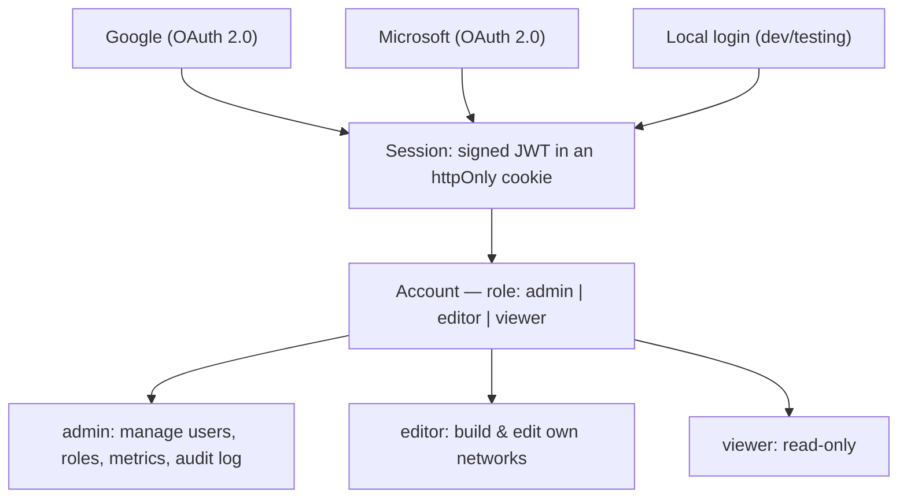

# Organizational & Access Management

How identity, roles, and administration work in **NetViz** — the same model you
know from a Google Workspace or Microsoft 365 admin console: people sign in with
their corporate identity, and an **administrator** assigns each account a
**role** that decides what they can do.

> **TL;DR — yes, you can set roles per account.** Sign in as an administrator,
> open **Administration → Users & roles**, and pick `admin`, `editor`, or
> `viewer` for any account. The very first person to sign in is the admin.

---

## Documents in this folder

| Document                                               | What it covers                                                                   |
| ------------------------------------------------------ | -------------------------------------------------------------------------------- |
| [roles-and-permissions.md](./roles-and-permissions.md) | The three roles and a full capability matrix                                     |
| [admin-guide.md](./admin-guide.md)                     | Day-to-day administration: assign roles, remove users, bootstrap the first admin |
| [access-control.md](./access-control.md)               | The technical enforcement model (auth, middleware, endpoints, data isolation)    |
| [account-lifecycle.md](./account-lifecycle.md)         | How accounts are created, onboarded, role-changed, and removed                   |

---

## The model at a glance

- **Identity** comes from Google, Microsoft, or a local login (Google/Microsoft
  are real OAuth 2.0; local is for development/self-host without an IdP).
- **The first account to sign in becomes `admin`.** Every later account defaults
  to `editor`.
- **Only an `admin` can change roles** — exactly like a super-admin in Google
  Workspace / Microsoft 365.
- **Data is isolated per user**: each signed-in person has their own saved
  networks. Roles gate *capabilities*, not visibility into other people's data.

See [roles-and-permissions.md](./roles-and-permissions.md) for the exact matrix.
