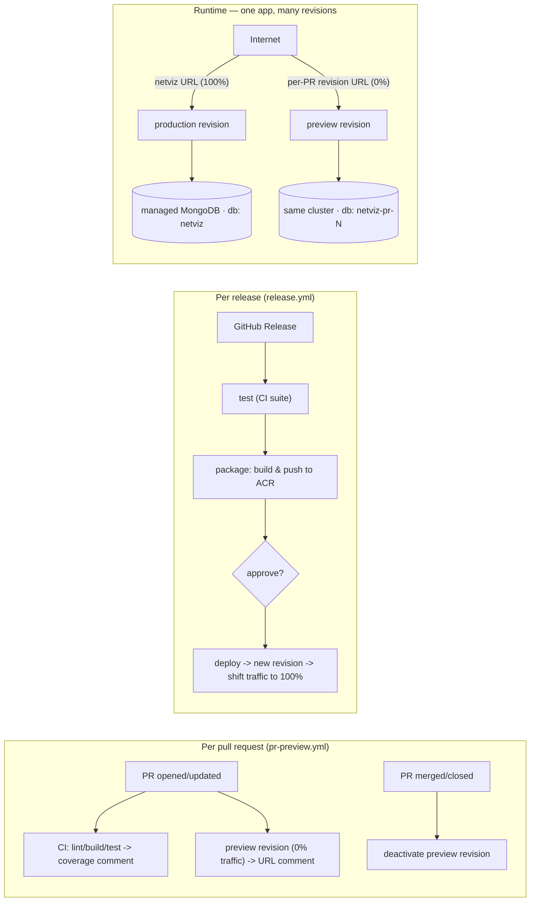

# Deployment

NetViz is a single self-contained container (Express API that also serves the
built SPA). It deploys to **Azure Container Apps** — managed HTTPS ingress, a
free `*.azurecontainerapps.io` URL, and no server to patch. The database is a
managed MongoDB (Cosmos DB for MongoDB vCore, or MongoDB Atlas).

There is exactly **one Container App: `netviz`**, in **multiple-revision mode**.
Production and every PR preview are revisions of that same app — no second app,
no extra infrastructure. Production holds **100% of the traffic** on the app's
main URL; a preview is a **zero-traffic revision** reachable only at its own
revision URL. Only a release moves production traffic.



## Guides

- **[azure-container-apps.md](./azure-container-apps.md)** — the full runbook:
  provision (ACR, database, Container App), no-domain setup (free ACA URL),
  custom domains, and continuous delivery.

## Per-PR previews (pr-preview.yml)

Every pull request gets an isolated preview **on the production app itself**, as
an extra revision:

1. **test -> coverage comment** — [`ci.yml`](../.github/workflows/ci.yml) runs
   lint/build/tests and posts the server coverage as a sticky PR comment.
2. **preview -> URL comment** — [`pr-preview.yml`](../.github/workflows/pr-preview.yml)
   builds the PR image and copies a new revision **from the production revision**,
   overriding only the image and a couple of env vars. It lands with a traffic
   weight of 0 and is reachable at its own FQDN
   `https://netviz--pr-<N>-<sha>.<region>.azurecontainerapps.io`, posted as a
   sticky comment.
3. **merge/close -> teardown** — closing the PR deactivates its preview
   revision(s), stopping the replica. Nothing to clean up by hand.

Three things keep a preview from harming production, even though they share an
app:

- **Traffic** — `pr-preview.yml` never calls `az containerapp ingress traffic
  set`. A new revision in multiple-revision mode starts at weight 0, so a preview
  *cannot* take production traffic; the workflow also asserts its own weight is 0
  and deactivates itself if it somehow isn't.
- **Data** — the preview inherits production's Mongo connection secret but
  overrides **`MONGODB_DB_NAME=netviz-pr-<N>`**, so it lands on its own database
  in the same cluster. It can't read or write production data, and it seeds its
  own demo topology on first load. (This is why `dropCurrentDatabase()` honours
  `MONGODB_DB_NAME` — otherwise `DB_RECREATE=true` on a preview would drop
  production's database.)
- **No leak-back** — both workflows copy from *the revision currently serving
  100% of traffic*, never from `latest`. Copying from `latest` would drag a
  preview's `MONGODB_DB_NAME` into the next production release and point
  production at a throwaway PR database.

Sign-in: a preview's URL is not a registered OAuth redirect URI, so previews set
`ALLOW_DEV_LOGIN=true` to stay reviewable. That's safe precisely because the
preview database is a throwaway.

It is inert until you set the repository variable **`PREVIEW_ENABLED=true`**, and
never runs for fork PRs (their token can't read secrets). Preview deploys use the
`staging` GitHub environment purely for its OIDC identity — they never require
approval and never touch production.

> **Cost note.** Preview revisions run at `minReplicas=0`, so an idle preview
> costs nothing and cold-starts on the first request. Nothing extra is
> provisioned: previews reuse the production app and its Mongo cluster.

## Releases -> production (release.yml)

Publishing a GitHub Release (`v1.2.3`) is the **only** thing that moves
production traffic. [`release.yml`](../.github/workflows/release.yml) runs three
jobs on the tagged commit:

1. **test** — reuses [`ci.yml`](../.github/workflows/ci.yml) so nothing ships
   that hasn't passed lint/build/tests.
2. **package** — [`package.yml`](../.github/workflows/package.yml) builds the
   client + Docker image and pushes it to ACR with the admin credentials.
3. **deploy -> production** — [`deploy.yml`](../.github/workflows/deploy.yml)
   copies a new revision of `netviz` from the current production revision with
   that image, **waits for it to report healthy**, and only then shifts 100% of
   the traffic onto it. If the revision never becomes healthy the traffic is never
   moved and production keeps serving the old one. Give the `production`
   environment a **Required reviewers** rule so this job pauses for a maintainer's
   approval — the manual go-live gate.

`deploy.yml` also runs standalone (`workflow_dispatch` with a `tag`), so it
doubles as the rollback tool: dispatch it with any older tag to cut production
back to it. The revision it replaced is kept active, so the fastest rollback of
all is a single command:

```bash
az containerapp ingress traffic set -g netviz-rg -n netviz \
  --revision-weight <previous-revision>=100 <bad-revision>=0
```

### One-time setup

- **Secrets** (repo-level): `AZURE_CLIENT_ID`, `AZURE_TENANT_ID`,
  `AZURE_SUBSCRIPTION_ID`, `ACR_USERNAME`, `ACR_PASSWORD`.
- **Variables** (repo-level): `ACR_NAME`, `IMAGE_NAME`, `RESOURCE_GROUP`,
  `CONTAINERAPP_NAME` (`netviz` — the one and only app).
- **Environments**: `staging` (no gate — used only for preview OIDC) and
  `production` (**Required reviewers** = the go-live gate).
- **OIDC**: one federated credential per environment on the app registration,
  subjects `repo:<owner>/<repo>:environment:staging` and
  `repo:<owner>/<repo>:environment:production` (the service principal is
  Contributor on the resource group).
- **Revision mode**: the app must be in multiple-revision mode. Both workflows
  enforce it, but you can set it by hand once:
  `az containerapp revision set-mode -g netviz-rg -n netviz --mode multiple`
  (traffic stays on the current revision).
- **Previews**: `gh variable set PREVIEW_ENABLED -R <owner>/<repo> --body true`.

See the runbook for the one-time provisioning of the registry, database and
Container App.

## Related

- Image / app metadata (OCI labels, footer version) — see
  [`application/Dockerfile`](../application/Dockerfile) and
  [`application/client/.env.example`](../application/client/.env.example).
- Roles & administration — see [`organizational/`](../organizational/README.md).
